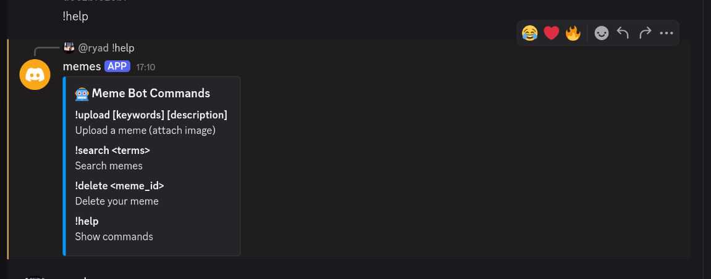
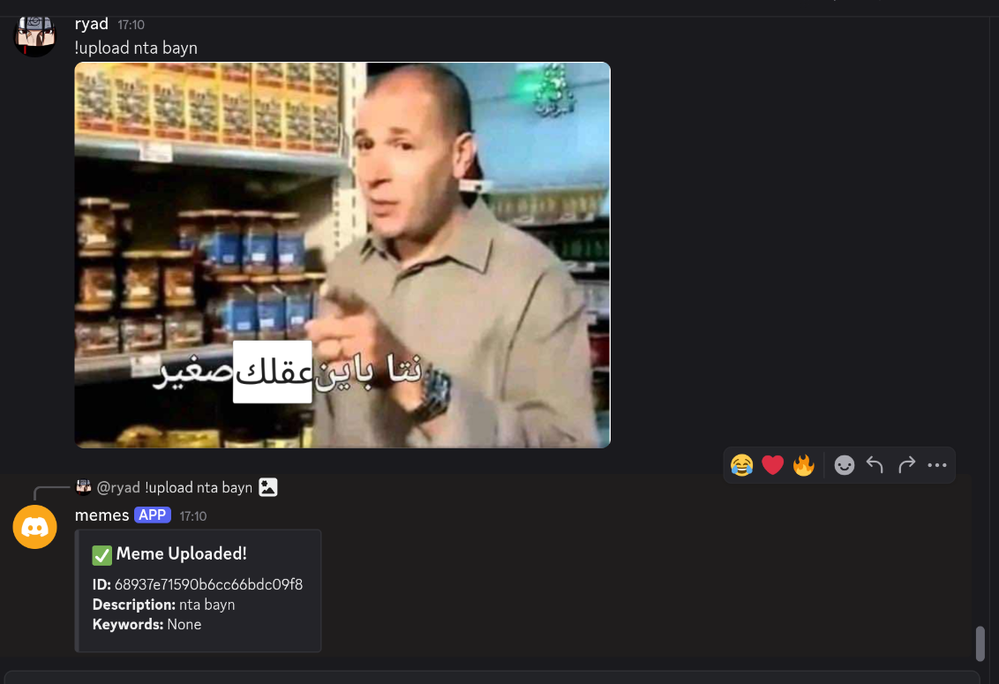
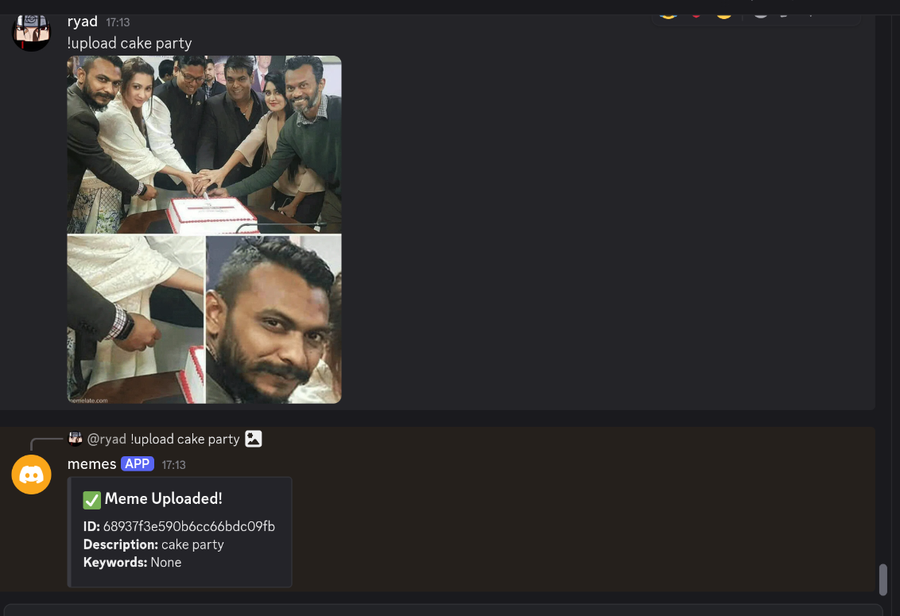
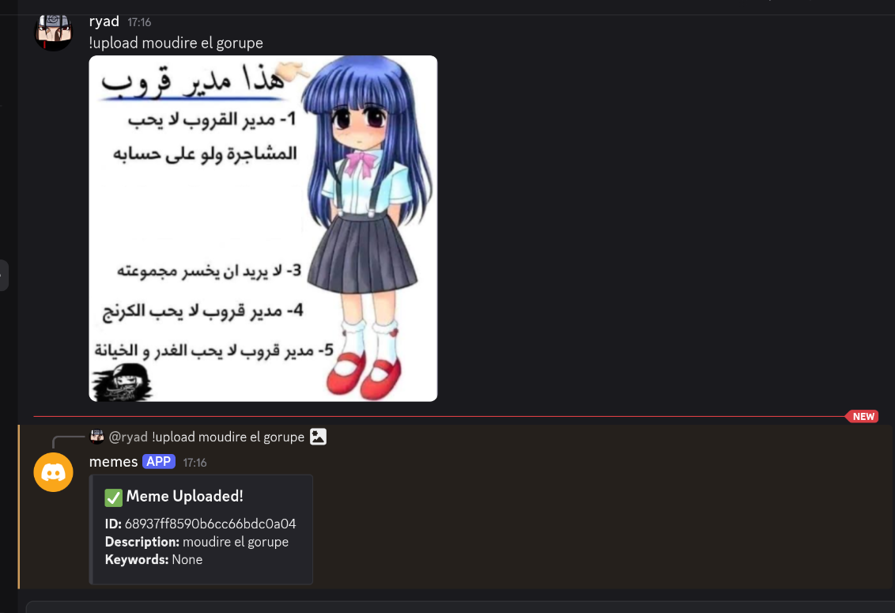
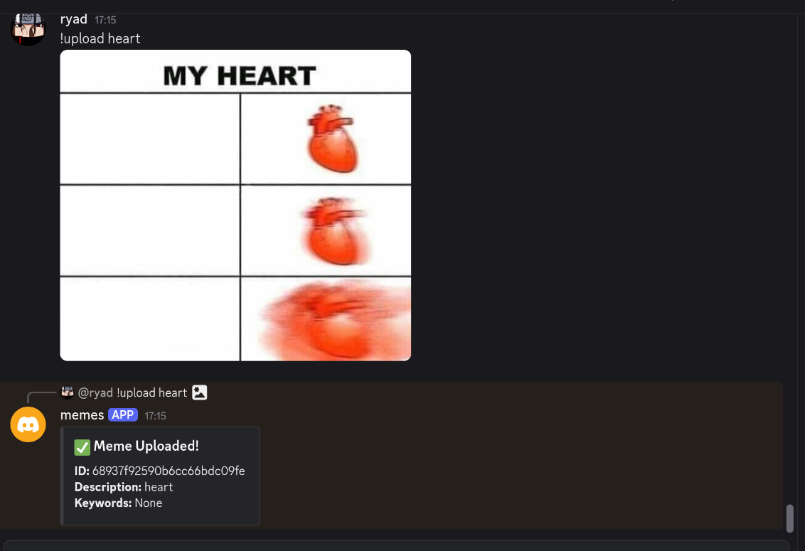
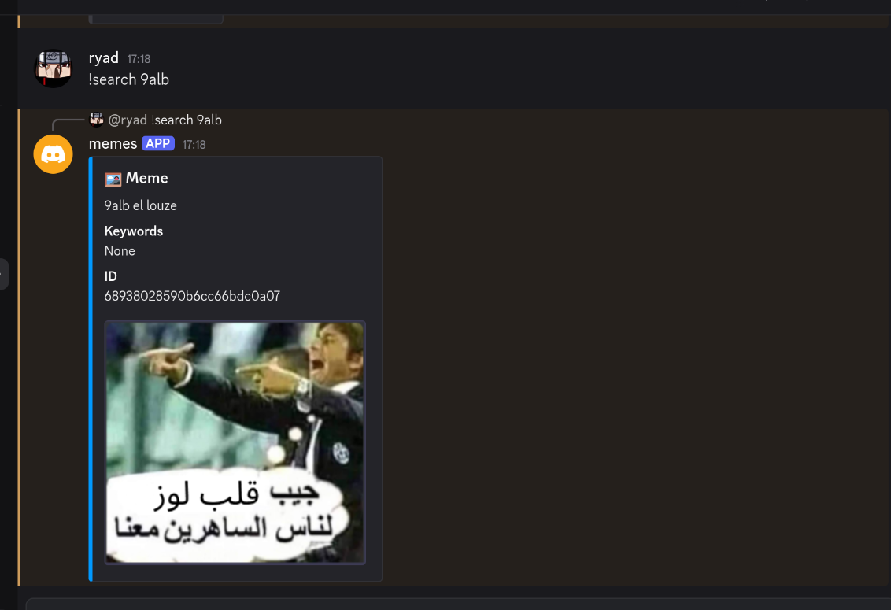
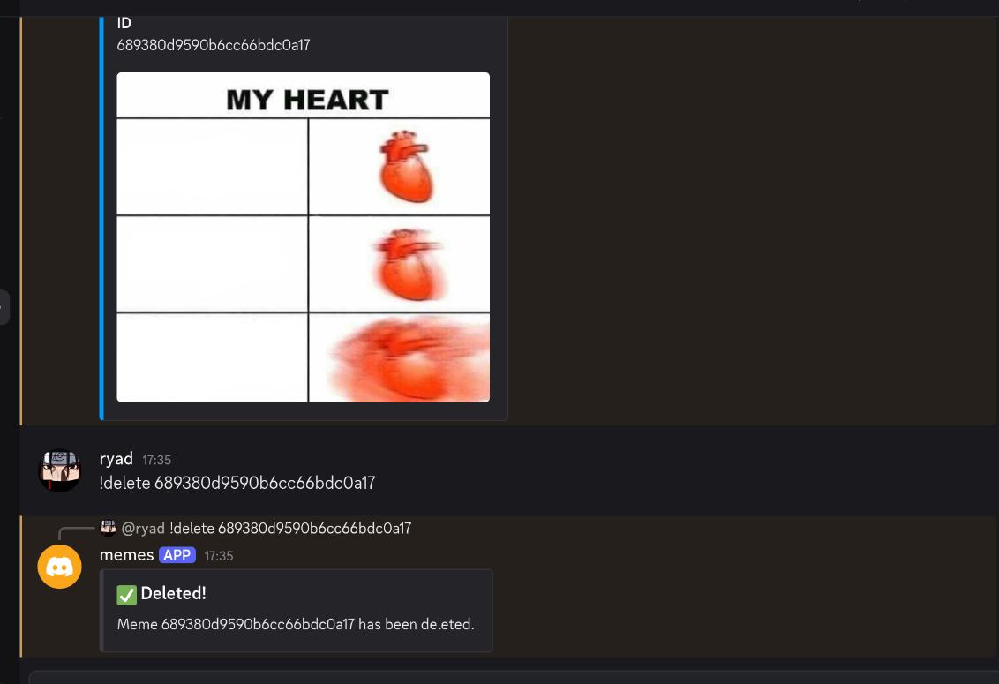

#  Meme Bot

A Discord bot that allows users to upload, search, and delete memes. Memes are stored and searchable by keywords or descriptions.

---

##  Bot Functionalities

###  !help

Displays all available commands supported by the bot.

---

###  !upload

Allows users to upload a meme by attaching an image to their message.

---

###  !search

Lets users search memes using keywords or descriptions.

---

###  !delete

Deletes a meme by its ID.

---

